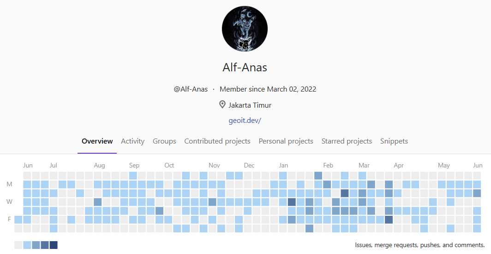
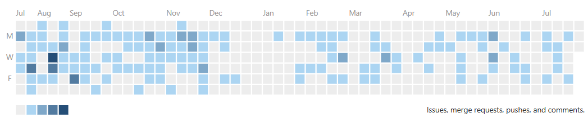
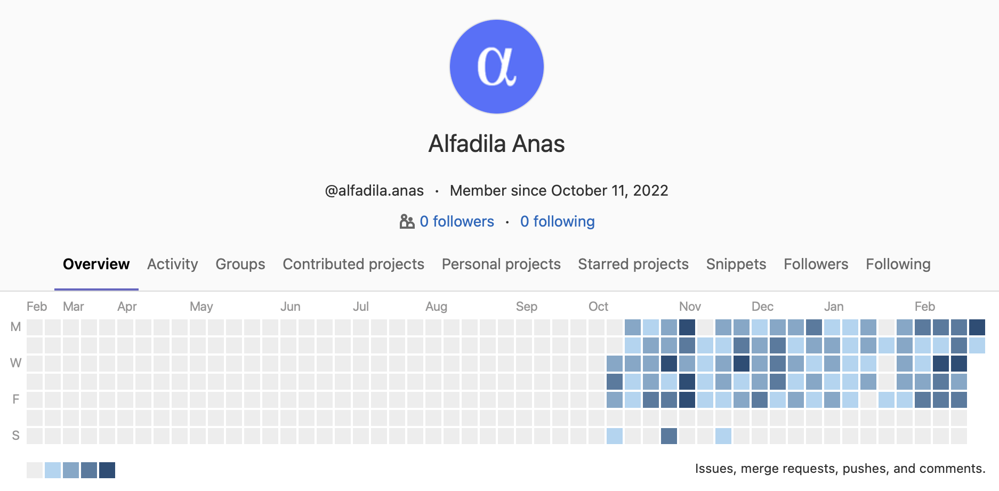

# Hi there, Alf-Anas here... 👋

This is my personal github repository, for project related to GeoSpatial Technology, I often organize it in my personal organization repository [GeoIT Developer](https://github.com/GeoIT-Developer)

- 🔭 I’m currently working on something related to Social and GIS apps
- 🌱 I’m currently learning backend and devops
- 👯 I’m looking to collaborate on something useful and helping other people
- 🤔 I’m looking for help with apps modularization
- 💬 Ask me about GIS related field
- 📫 How to reach me: ...
- 😄 Pronouns: Ey
- ⚡ Fun fact: I'm not fun

#

 

#

  
Gitlab Contributor

  I just loved to see these contribution things, so I'll saved it here before lost.

## BKN

I can't view the oldest data -\_-

## Skylab

